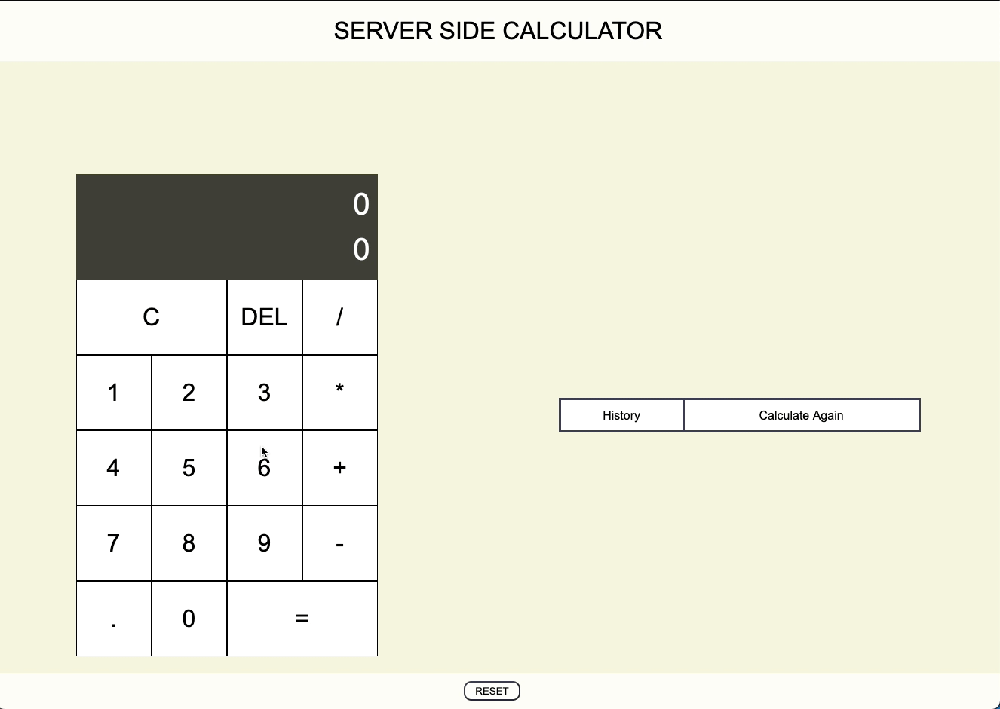

# JQuery Server Side Calculator:

## Description

_Duration: 18 hour Sprint_

Over the course of a weekend, the goal was to create a functional web based application. The web based application allow users to use a calculator and keep track of their calculation history

## Screen Shots
GIF showing application features:

### Prerequisites
- [Node.js](https://nodejs.org/en/)
- Express 
- Body-Parser

## Installation
1. Clone this repository for your own access.
2. Open up your editor of choice and run `npm install`
3. Run `npm start`  in terminal.
4. Navigate to http://localhost5000/

## Usage
This web application is meant to create an interactive calculator:
 1. Users can enter in calculations in the calculator
 2. Users can see a table that tracks the history of calculations
 3. Users can repeat a past calculation they have done.

## Acknowledgement
Thanks to [Prime Digital Academy](www.primeacademy.io) who equipped and helped me to make this application a reality.

## Support
If you have suggestions or issues, please email me at [paulhoanglong@gmail.com](www.google.com)